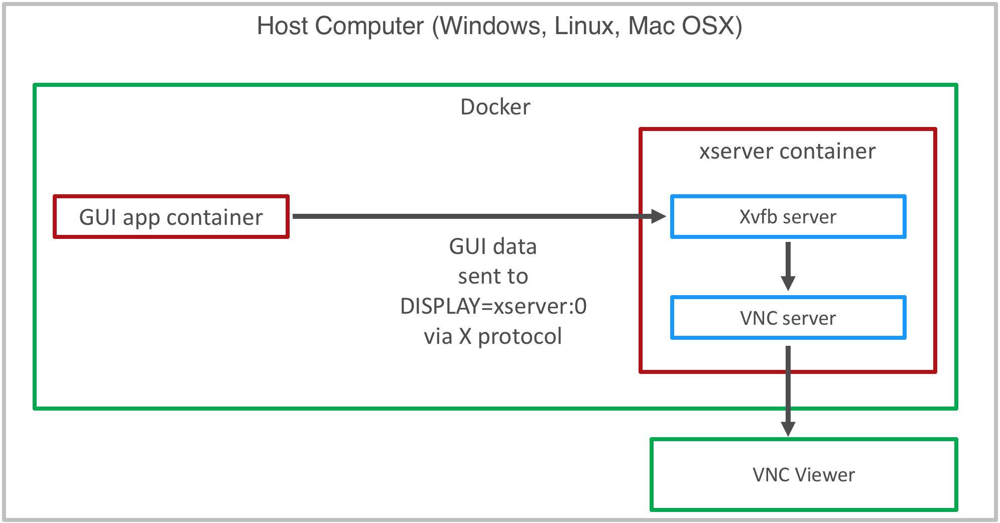
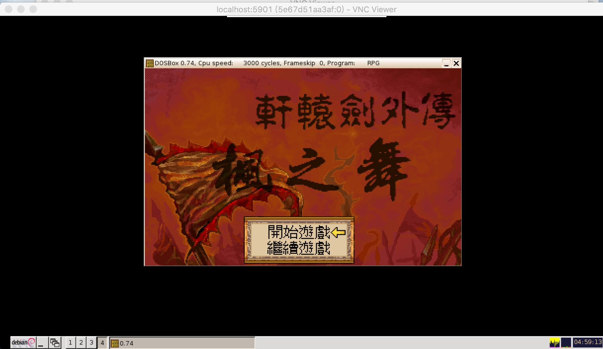

<h1 align="center">$PROJ_NAME$</h1>

<p align="center">Your Universal GUI Display for Docker</p>

## What is $PROJ_NAME$?
**$PROJ_NAME$** is a docker image to display your GUI application in Docker.
**$PROJ_NAME$** contains:

* An [X virtual framebuffer server (Xvfb)](https://en.wikipedia.org/wiki/Xvfb) to receive GUI data from other containers.
* A [VNC](https://en.wikipedia.org/wiki/Virtual_Network_Computing) server to let you see the GUI in a VNC viewer on your host computer.

You could also choose to disable the VNC server and only open the Xvfb (for example, you want to do GUI auto tests without real display).
The following figure is how **$PROJ_NAME$** works:



## Installation

* Step 1. Install `docker` by following [Docker official installation guide](https://docs.docker.com/install/).
Docker is cross-platform so you can run **$PROJ_NAME$** on Mac OSX / Linux / Windows.

* Step 2. Download the image, run
```
$ docker pull $DOCKER_REPO$:$DOCKER_VER$
```

* Step 3. Install a VNC viewer. I recommend [RealVNC](https://www.realvnc.com/en/connect/download/viewer/).

* Step 4. Initialize the **$PROJ_NAME$** container, the command is as follows:
```
$ docker run --name ${container_name} \
  -e VNC_PASSWORD=${password} \
  -e SCREEN_SIZE=${screen_size} \
  -e SCREEN_DPI=${screen_dpi} \
  -e DISABLE_VNC=${disable_vnc} \
  -e DISABLE_WM=${disable_wm} \
  -p ${host_port}:5900 \
  $DOCKER_REPO$:$DOCKER_VER$
```
where `container_name`, `password` and `host_port` are must items; `screen_size`, `screen_dpi`, `disable_vnc`, and `disable_wm` are optional.

For example, to enable the Xvfb and the VNC server, just run
```
$ docker run --name mydisplay -e VNC_PASSWORD=1234 -p 5901:5900 $DOCKER_REPO$:$DOCKER_VER$
```
For other scenarios of this step, please refer to the section **Other examples to initialize $PROJ_NAME$**.

* Step 5. Initialize your GUI application container with link to **$PROJ_NAME$** container
(assume your GUI application image is `myapp-img`, and you want to name the app container as `myapp-ctn`),
please run
```
$ docker run --name myapp-ctn --link mydisplay:$PROJ_NAME$ --volumes-from mydisplay -dt myapp-img 
```

* Step 6. Setup authentication cookie in your GUI application container.
Just copy `setup-xclient.sh` of this repo into your container root and run it as follows:
```
$ docker cp setup-xclient.sh myapp-ctn:/
$ docker exec -it myapp-ctn bash
$ chmod 755 /setup-xclient.sh; /setup-xclient.sh $PROJ_NAME$; source ${HOME}/.bashrc
```
Then please run the command of your GUI application in `myapp-ctn`.

* Step 7. Open your VNC viewer in the host computer (assume you initialize **$PROJ_NAME$** like Step 4),
connect to `localhost:5901` and type in the password `1234`,
then you can see your GUI appication window inside the VNC viewer window like the following figure:



## Other examples to initialize $PROJ_NAME$

* I want to set `SCREEN_SIZE` as `1200x675x2` and `SCREEN_DPI` as `75` for Xvfb:
```
$ docker run --name mydisplay -e VNC_PASSWORD=1234 -e SCREEN_SIZE=1200x675x24 -e SCREEN_DPI=75 -p 5901:5900 $DOCKER_REPO$:$DOCKER_VER$
```

* I want to enable VNC server but disable the window manager:
```
$ docker run --name mydisplay -e VNC_PASSWORD=1234 -e DISABLE_WM=true -p 5901:5900 $DOCKER_REPO$:$DOCKER_VER$
```
If you disable the window manager, you can not resize your GUI application window size.

* I want to disable the VNC server:
```
$ docker run --name mydisplay -e DISABLE_VNC=true $DOCKER_REPO$:$DOCKER_VER$
```

